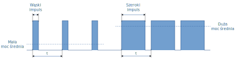
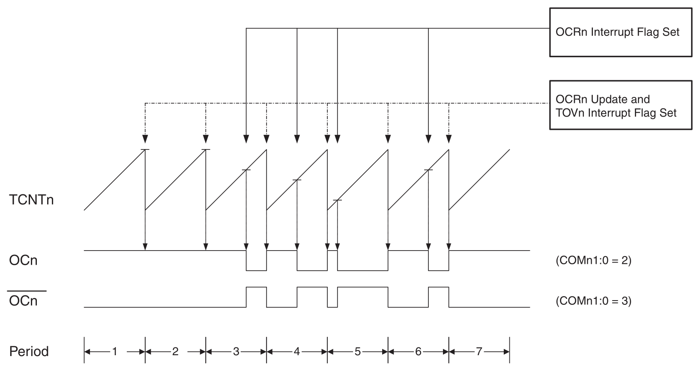

---
title: "Instrukcja laboratorium systemów wbudowanych"
subtitle: "Ćwiczenie 3: Regulacja jasności LED za pomocą timera"
author: [Mariusz Chilmon <<mariusz.chilmon@ctm.gdynia.pl>>]
lang: "pl"
titlepage: yes
titlepage-logo: "logo.jpg"
colorlinks: yes
header-includes: |
  \usepackage{awesomebox}
...

> Fortune favors the prepared mind.
>
> — _Louis Pasteur_

# Cel ćwiczenia

Celem ćwiczenia jest zapoznanie się z:

* regulacją za pomocą modulacji szerokości impulsu,
* wykorzystaniem timera jako źródła sygnału PWM,
* odmierzaniem czasu za pomocą timera.

# Uruchomienie programu wyjściowego

1. Podłącz diody `LED1`…`LED2` do pinów `PB2`…`PB3` portu `PORTB`.
1. Zweryfikuj, czy dioda `LED1` świeci maksymalną jasnością.
1. Zweryfikuj, czy dioda `LED2` mruga słabym światłem.

Dioda `LED2` podłączona jest do pinu `PB3`, którego alternatywną funkcją jest `OC0` (_Timer/Counter0 Output Compare Match Output_), co oznacza, że jest sterowany zdarzeniem generewanym przez `Timer/Counter0`. Timer ten został skonfigurowany w trybie _Fast PWM_. Jest to tryb, w którym możliwe jest regulowanie mocy dostarczanej do urządzenia wyjściowego (np. LED) poprzez szybkie włączanie i&nbsp;wyłączanie zasilania. Zmieniając proporcję między czasem włączenia i wyłączenia możemy dostarczyć mniej lub więcej mocy w jednostce czasu. W naszym przypadku wpływa to na jasność diody `LED2`.

Licznik `TCNT` timera w trybie _Fast PWM_ zmienia się od wartości `BOTTOM` (`0x00`) do wartości `TOP` (`0xFF`). Przy wartości `0x00` wyjście `OC0` załącza sterowane urządzenie, a przy zrównaniu licznika z&nbsp;zaprogramowaną wartością `OCR0` — wyłącza je.

\awesomebox[purple]{2pt}{\faMicrochip}{purple}{W mikrokontrolerze ATmega32A \lstinline{Timer/Counter0} obsługuje tylko jeden rejestr \lstinline{OCR0} i wyjście \lstinline{OC0}. ATmega1284P może generować dwa sygnały na wyjściach \lstinline{OC0A} i \lstinline{OC0B}, sterowane — odpowiednio — wartościami rejestrów \lstinline{OCR0A} i \lstinline{OCR0B}. W~tym zadaniu korzystamy tylko z wyjścia \lstinline{OC0A} i rejestru \lstinline{OCR0A}.}

\awesomebox[purple]{2pt}{\faMicrochip}{purple}{Mikrokontrolery AVR udostępniają jeszcze tryb \textit{Phase Correct PWM}, w którym uzyskiwana częstotliwość sygnału jest mniejsza, ale sposób synchronizacji impulsów jest korzystniejszy dla sterowania silników.}

# Zadanie podstawowe

## Wymagania funkcjonalne

1. Dioda `LED1` świeci maksymalną jasnością.
1. Dioda `LED2` świeci połową jasności bez zauważalnego mrugania.

## Modyfikacja programu

Zmodyfikuj funkcję `pwmInitialize()`.

\awesomebox[teal]{2pt}{\faCode}{teal}{Część kodu posiada dwe wersje, ze względu na wspomniane różnice w budowie timerów między dwoma mikrokontrolerami. Zwróć uwagę, z którym mikrokontrolerem pracujesz.}

\awesomebox[violet]{2pt}{\faBook}{violet}{Mruganie diody jest zauważalne, ponieważ timer taktowany jest zbyt wolnym zegarem. Zapoznaj się z bitami \lstinline{CS00}…\lstinline{CS02}.}

\awesomebox[teal]{2pt}{\faCode}{teal}{Pamiętaj o zdefiniowaniu odpowiednio nazwanych stałych i udokumentowaniu ich.}

# Zadanie rozszerzone

## Wymagania funkcjonalne

1. Dioda `LED1` świeci maksymalną jasnością.
1. Jasność diody `LED2` zmienia się płynnie od minimalnej do maksymalnej i z powrotem.

## Modyfikacja programu

Wykorzystaj przerwanie `TIMER0_OVF`, które wywoływane jest po przepełnieniu timera (na koniec każdego cyklu odliczania).

\awesomebox[violet]{2pt}{\faBook}{violet}{Przerwanie włącza flaga \lstinline{TOIE0} oraz funkcja \lstinline{sei()}.}
